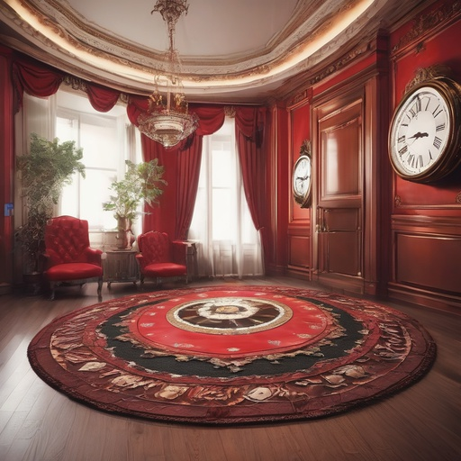

<div align="center">

# Balancing Fidelity and Diversity in Diffusion Models via Symmetric Attention Decomposition: Hopfield Perspective

**Hyunmin Cho, Woo Kyoung Han, Kyong Hwan Jin**

Department of Electrical Engineering, Korea University

**ICML 2026 Regular**

[](https://hyeon-cho.github.io/Balancing/)
[](https://openreview.net/forum?id=E0MKfKmQkT)

</div>

---

Text-to-image diffusion models sometimes settle into **metastable mixtures** — outputs that
incoherently blend incompatible features (a missing object, a fused structure) — and fixing this
usually comes at the cost of diversity. We look at this through an associative-memory lens:
the attention matrix **QKᵀ** encodes pairwise feature associations, and splitting it into its
**symmetric** part (a Hopfield-style *energy landscape* that supports stable retrieval) and its
**skew-symmetric** part (*circulation* that drives drift on that landscape) disentangles the two
behaviors. Scaling the circulation (**α**) and blending the perturbed retrieval back into the
baseline (**β**) yields a **training-free, test-time knob** for navigating the fidelity–diversity
trade-off — no fine-tuning, no architecture change.

<div align="center">
<table>
  <tr>
    <td align="center"><br><sub>SDXL</sub></td>
    <td align="center"><br><sub>SDXL + Ours (α=1.05, β=3)</sub></td>
    <td align="center"><br><sub>SDXL</sub></td>
    <td align="center"><br><sub>SDXL + Ours (α=1.05, β=3)</sub></td>
  </tr>
  <tr>
    <td colspan="2" align="center"><sub><i>"<b>A fancy clock</b> stands in the room with red carpet."</i></sub></td>
    <td colspan="2" align="center"><sub><i>"A laptop with a picture of <b>the earth</b> on its screen ..."</i></sub></td>
  </tr>
</table>
</div>

## Highlights

- 🔌 **Drop-in**: one `set_attn_processor(...)` call on a standard `diffusers` SDXL pipeline; `α = 1` recovers vanilla attention exactly.
- 🎛 **Training-free control**: two scalars `(α, β)` modulate circulation at test time to trade off structural coherence and diversity.
- 📉 **Hopfield diagnostics included**: energy, instability fraction, and alignment score for identifying metastable retrievals.
- 🛡 **Adaptive variant**: an η_M-guided rule that injects circulation only where needed, safeguarding well-formed samples from over-perturbation.

## News

- **[2026.07.06]** 🚀 Code released.
- **[2026.04.30]** 🎉 The paper is accepted to **ICML 2026 Regular**.

## Installation

Python 3.10 recommended.

```bash
# 1) torch matching your CUDA (example: cu121)
pip install torch==2.5.1 --index-url https://download.pytorch.org/whl/cu121
# 2) core deps
pip install -r requirements.txt
# 3) (optional) evaluation deps
pip install -r requirements-eval.txt
```

> Tested with `diffusers` 0.32.2 / 0.35.1 and `transformers` 4.46.3. If you use `diffusers <= 0.32`,
> keep `transformers < 4.50`.

SDXL (`stabilityai/stable-diffusion-xl-base-1.0`) is downloaded automatically on first run.
All paper settings: classifier-free guidance ω = 5.0, 30 steps, fp16 — a single 24 GB GPU suffices.

## Use it in your own pipeline

```python
import torch
from diffusers import StableDiffusionXLPipeline
from attentions.symmetry_attn_vx import SkewAttnProcessor2_0

pipe = StableDiffusionXLPipeline.from_pretrained(
    "stabilityai/stable-diffusion-xl-base-1.0", torch_dtype=torch.float16
).to("cuda")

# circulation control on all UNet self-attention layers
pipe.unet.set_attn_processor(
    SkewAttnProcessor2_0(alpha=1.05, beta=3.0, compute_energy=False, cache_last_energy=False)
)

image = pipe("A fancy clock stands in the room with red carpet.").images[0]
image.save("ours.png")
```

For the adaptive variant, swap in `EtaSkewAttnProcessor2_0` from
`attentions/symmetry_attn_vx_eta.py` (see below).

## Quickstart (CLI)

```bash
# vanilla SDXL
python run_single.py --baseline --prompt "A fancy clock stands in the room with red carpet." --out baseline.png

# + static circulation control (paper operating point α=1.05, β=3)
python run_single.py --alpha 1.05 --beta 3 --prompt "A fancy clock stands in the room with red carpet." --out ours.png

# + adaptive circulation control (η_M-guided; safeguards against over-perturbation)
python run_single.py --mode eta --eta_alpha --alpha_mode dev --eta_beta --alpha 1.2 --beta 5 \
    --prompt "A fancy clock stands in the room with red carpet." --out adaptive.png
```

## COCO experiments

### Generation sweep

```bash
# baseline
python run_coco_sweep.py --gpu 0 --prompts_file coco_prompts/coco_1.txt --fast

# static circulation control, e.g. (α, β) = (1.05, 5)
python run_coco_sweep.py --gpu 0 --prompts_file coco_prompts/coco_1.txt \
    --alpha 1.05 --beta 5 --fast
```


### Adaptive circulation control

```bash
# static excessive setting (α, β) = (1.20, 5)
python run_coco_sweep.py --gpu 0 --prompts_file coco_prompts/coco_split_gpu0.txt \
    --alpha 1.2 --beta 5 --fast

# adaptive counterpart (η_M-guided α and β)
python run_coco_sweep.py --gpu 0 --prompts_file coco_prompts/coco_split_gpu0.txt \
    --mode eta --eta_alpha --alpha_mode dev --eta_beta --alpha 1.2 --beta 5 --fast
```

### Evaluation

```bash
# per-image preference metrics (ImageReward / Aesthetic / CLIPScore / HPS / PickScore)
python eval_metrics.py --parent_dir outputs/exp3_sdxl_skewmask/prompts_coco_1 --gpu 0

# FID + CLIP score (FID needs MSCOCO2014 val images)
python eval_fid_clip.py --parent_dir outputs/exp3_sdxl_skewmask/prompts_coco_1 \
    --real_dir /path/to/MSCOCO2014/val2014
```

`eval_metrics.py` caches per-image scores under `eval_score_cache/` and reports means, ranks, and
paired deltas against the baseline run.

Generation itself needs no dataset (prompt lists ship under `coco_prompts/`). For FID-style
comparisons, download [MSCOCO 2014 val images + captions](https://cocodataset.org/#download) and
pass `--coco_root /path/to/MSCOCO2014` (expects `val2014/` and
`annotations/captions_val2014.json`) to `run_coco_sweep.py`.

## Hopfield stability measures

`hopfield_energy/log_energy.py` implements the three diagnostics used in the paper's analysis —
energy `E_X`, instability fraction `r_X` (`lam_neg_frac`), and alignment score `Align_X`
(`align_cos`) — via the `hopseq_start / hopseq_log_after_Hx / hopseq_finalize` API, which can be
hooked after any retrieval call. The processors also accumulate per-layer energy statistics
(`EnergyStats`) when constructed with `compute_energy=True`.


## Citation

```bibtex
@inproceedings{
cho2026balancing,
title={Balancing Fidelity and Diversity in Diffusion Models via Symmetric Attention Decomposition: Hopfield Perspective},
author={Hyunmin Cho and Woo Kyoung Han and Kyong Hwan Jin},
booktitle={Forty-third International Conference on Machine Learning},
year={2026},
url={https://openreview.net/forum?id=E0MKfKmQkT}
}
```

## Acknowledgements

Built on [🤗 diffusers](https://github.com/huggingface/diffusers) and
[Stable Diffusion XL](https://huggingface.co/stabilityai/stable-diffusion-xl-base-1.0).
